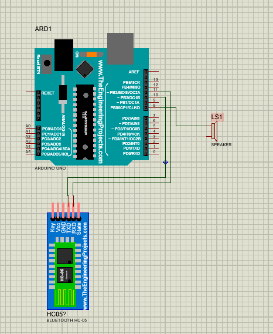
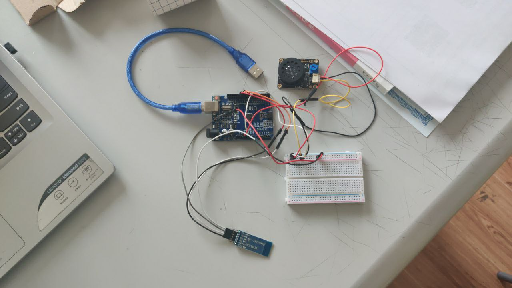
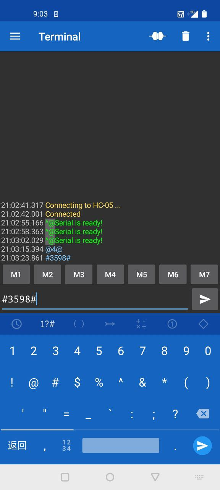
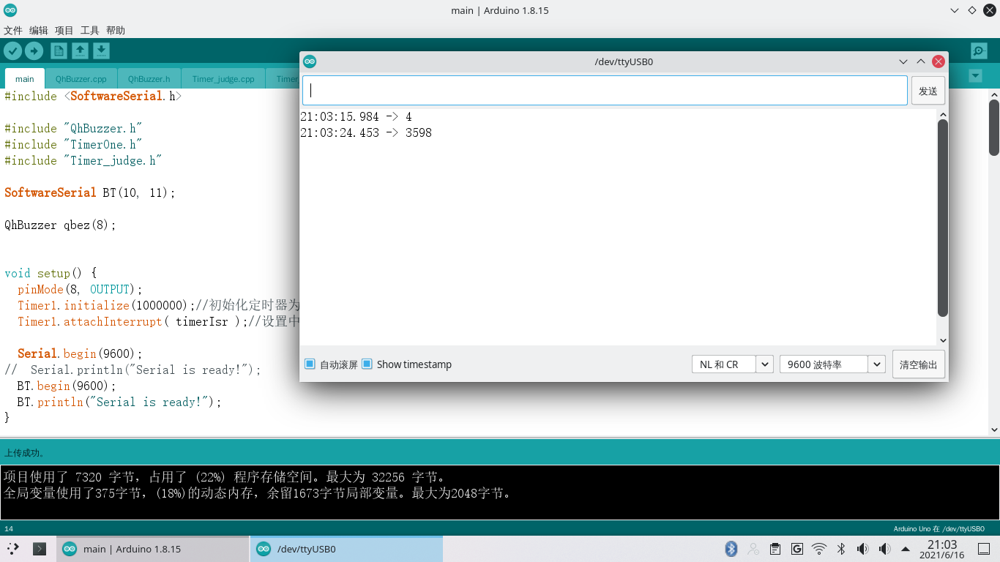

# 使用Ardiuno单片机制作蓝牙闹钟

## 项目简述
### 设计思想
本次作业个人使用了Arduino uno单片机制作了一个可以通过蓝牙进行校时、发送请求，并通过喇叭播放音乐的电子闹钟。选择Ardiuno进行设计是因为Ardiuno的编程难度相对更小，更易上手，同时使用的人也相对更多，便于资料的查询。
### 组成模块
该作品的基本电路图如下所示：



该电路图主要分为三个模块，Arduino UNO开发板，HC-05蓝牙模块以及一个扬声器(因扬声器模块在网上找不到对应的电路图，故使用一个简单的speaker代替)，实物图如下



因扬声器和HC-05供电都由UNO提供，故需要一个面包板进行并联。

### Arduino代码部分

本电子闹钟实现了以下两个功能

1. 开机后，通过蓝牙连接后发送当前时间距离今日零点的秒数，格式为
```
#{当前时间对应的秒数}#
比如若当前时间为1：00 AM
则输入为#3600#
```
进行校时，校时后，每当整点时间，都会发出音乐进行报时。

2. 开机后，输入对应的秒数，秒数过后，播放音乐，格式为
```
@{间隔秒数}@
比如若想让单片机5秒后播放音乐
则输入为@5@
```
代码整体有五个文件，分别为main.ino, QhBuzzer.h, QhBuzzer.cpp ,Time_Judge.h, Time_Judge.h, Time_Judge.cpp。其中，QhBuzzer负责播放音乐，Time_Judge负责检验时间是否到达整点，而main负责整体的项目逻辑结构，同时负责时钟的计时，蓝牙信息的接收。

## 细节分析

### 定时器中断
为了制作一个闹钟，我们应该至少有一个全局变量来记时，这个计时函数不能在loop中运行，因为如果处理器去处理其他函数，比如播放音乐时，就会将进程堵塞，导致记时不准。那么我的方式是使用中断来解决这个问题。该程序导入了外部库Timerone，此库与avr兼容，故我可以在arduino上使用该依赖
```cpp
#include "TimerOne.h"
```
顾名思义 TimerOne 库函数调用的是 Timer1 定时器。Arduino 的 PWM 输出是依靠内置的3个 Timer 来控制的。所以 Timer1 会同时影响到 D9、D10 两个端口的 analogWrite() 方法，但对本项目暂无影响。故在setup()中
```cpp
  Timer1.initialize(1000000);//初始化定时器为1s
  Timer1.attachInterrupt( timerIsr );//设置中断回调函数
```
接着定义全局变量
```cpp
bool mode_1=false;//模式标志符
bool mode_2=false;

volatile long second_1=0;//对应模式计时器
volatile long second_2=0;
volatile long pre_second_2=1;//不能和second_2一样
```

mode_1为定时闹钟是否开启的标志，mode_2为延时秒表是否开启的标志，second_1为定时闹钟的计时器，second_2为延时秒表的计时器，pre_second_2为延时秒表的预设时间。
在中断函数中，若某个模式开启，则每秒增加对应的计时器。
```cpp
void timerIsr()//定时器中断处理函数
{

  if(mode_1)
    second_1++;
  if(mode_2)
    second_2++;
}
```
### 扬声器原理
扬声器模块连接的是D8端口，所以首先要在setup函数中将该端口置为output
```cpp
  pinMode(8, OUTPUT);
```
音乐的播放方式主要来自于商家的提供的代码，播放内容为七种声调，循环播放一次。

在QhBuzzer.h中设置内容如图所示
```cpp
class QhBuzzer 
{
	public:
	    QhBuzzer();
	    QhBuzzer(unsigned char pin);//初始函数
	    void qtone(int frequency, long int duration = 0);//播放指定频率方波，时间对应的声音
	    void noqTone();
		void play(int num, unsigned int tx);//播放设置好的七种声调的声音，num决定播放哪一种，tx决定时间
};
```
播放声音的重点在于tone()函数
```cpp
tone(pin, frequency, duration)
tone(pin, frequency)
//pin代表连接扬声器的引脚，frequency代表发声频率，duration代表持续的时间，单位是毫秒。
```
在一个端口生成一个特定频率的方波，可以指定持续的时间。如果没有指定持续时间，就需要使用noTone()命令终止。端口用来连接到蜂鸣器或者是喇叭播放特定频率声音。

那么在play()中
```cpp
void QhBuzzer::play(int num, unsigned int tx)
{
	switch(num){
		case 1: tone(buzzer_pin,595, tx); break;
		case 2: tone(buzzer_pin,661, tx); break;
		case 3: tone(buzzer_pin,700, tx); break;
		case 4: tone(buzzer_pin,786, tx); break;
		case 5: tone(buzzer_pin,882, tx); break;
		case 6: tone(buzzer_pin,990, tx); break;
		case 7: tone(buzzer_pin,1112,tx); break;
    default: break;
	}
}
```

### 软串口接收蓝牙信息
在Arduino中，除了硬件串口外，还可以通过SoftwareSerial建立软串口，将某些特定的端口变成可以进行通讯的串口，接着将蓝牙的TXD，RXD端口进行连接，便可进行通讯。SoftwareSerial在建立串口的同时，也简化了信息传输的方式，从串口读取。发送信息可以使用库中封装好的对应方法，而不需要在主函数中轮讯寄存器。本项目选择了D10,D11作为其软串口，并选择了9600作为波特率进行通讯。

```cpp
#include <SoftwareSerial.h> 

SoftwareSerial BT(10, 11);

 Serial.begin(9600);
//  Serial.println("Serial is ready!");
  BT.begin(9600);
  BT.println("Serial is ready!");
```

接下来在每次loop中，都会读出一个字符，首先会判断该字符是否为终止符，若其第一次接到终止符，则开启对应终止符号的模式，并将接下来的字符存放于字符串中，若其第二次接受到终止符，则结束读取，并将读取的字符串用于设置计时器当前时间(second_1)或者预订时间(pre_second_2)

代码如下

```cpp
 if (BT.available()) {
    
      char val = BT.read();
      if(val==symbol_1)//若接受到模式一的终止符
      {
        if(mode_1)
        {
          second_1=input.toInt();
          input="";
          Serial.println(second_1);
        }
        else if (!mode_1)
        {
          mode_1=true;
        }

      }
      else if (val==symbol_2)
      {
        if(mode_2)
        {
          pre_second_2=input.toInt();
          input="";
          Serial.println(pre_second_2);
        }
        else if (!mode_2)
        {
          mode_2=true;
        }
      }
      else
      {
        input+=val;
      }
      
  }
```

## 运行结果
首先，我们需要一个串口调试助手发送蓝牙信息，在这里我手机下载了Serial Bluetooth Tools 软件，使用Arduino IDE将代码上传至单片机后，使用该软件进行连接，如图所示


接下来通过该串口，手机软件将会收到“serial is ready字符串”


输入@4@，#3598#,硬件串口处将会收到对应的数据信息





同时还将播放音乐


### 下一步改进
下一步的计划是能够加入sd卡模块，使单片机播放其中的对应音乐，并在每个时间节点播放不同的音乐，但该部分难度较大，因时间原因来不及进一步细化，打算后续有时间进一步跟进。